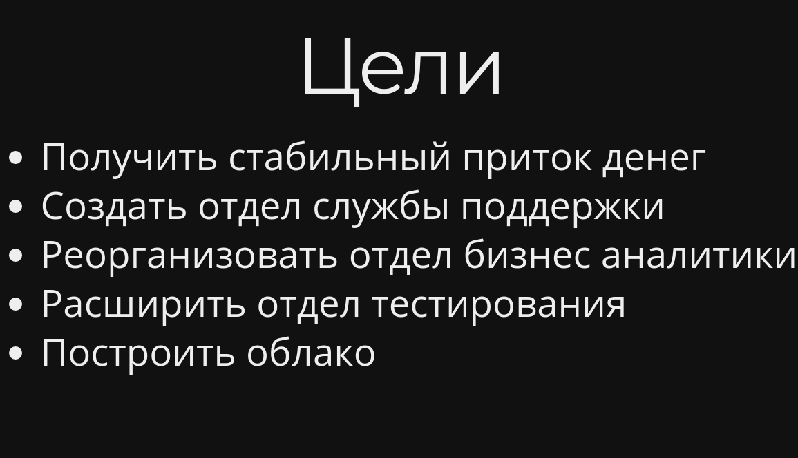

## Митап 26.12.09

---

## Новости

- Новые сотрудники
- Avtobys разгоняется
- Allpay/Innopay

---

## Офис менеджер

#### Анель

+++

## Сотрудники QA

- Айша
- Сандугаш

+++

## Сотрудники Dev

- Назым
- Алина
- Наджибулла
- Жансултан

+++

## Бизнес

- Нургуль - юрист
- Архат - аналитик
- Мольдир - бухгалтер
- Эльмира - бухгалтер
- Данияр - поддержка

---

## Allpay

- 48,6тыс кошельков
- 1,2млн транзакций
- 5тыс активных юзеров

+++?image=assets/images/allpay_total.png&size=auto 80%

---

## Avtobys

- 715 автобусов (x2)
- Транспортных карт 333,100 (x3)
- 842 терминала (x2)

+++?image=assets/images/avtobys_total.png&size=auto 80%
+++?image=assets/images/avtobys_atyrau.png&size=auto 80%
+++?image=assets/images/avtobys_semey.png&size=auto 80%
+++?image=assets/images/avtobys_semey_atyrau.png&size=auto 80%

---

## Что было?

#### Вспомним все важное

+++

## Облако

+++

## Атырау диф. тариф

+++

## Запуск Семей

+++

## Производство карт

+++

## Создание Innopay

---

## Что будет?

- Караганда
- Развитие Allpay/Innopay
- Развитие Avtobys

---

## Цели в 2019

---

## Цели в 2020

- Создать и развить frontend команду
- Монетизировать клиентскую базу пассажиров
- Построить отказоустойчивую архитектуру
- Расширить ЦОД
- Наладить производство транспортных карт
- Построить систему анализа данных
- Выйти на продажи в другие страны

